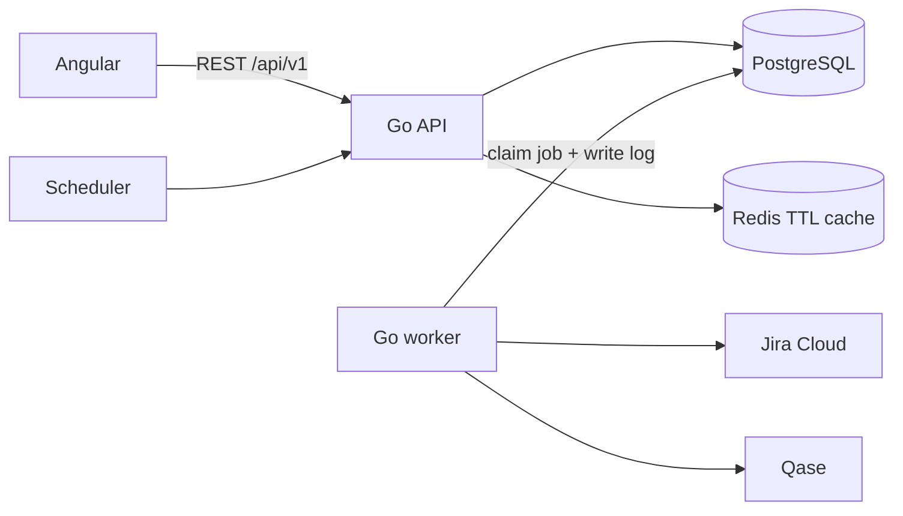

# QA Monitoring backend MVP: Go, PostgreSQL, Redis

**Status:** API, PostgreSQL models, Jira/Qase worker, and scheduled/manual sync implemented in the Go repository; live source configuration and verified mappings are pending.
**FE plan:** [Angular architecture](./FRONTEND-ARCHITECTURE.md).
**Scope:** Four approved dashboard screens, Jira/Qase import, durable sync history. Solr/RAG, reminders, and other modules in the older [broader technical design](./BACKEND-TECHNICAL-DESIGN.md) are outside this MVP.
**Connector runbook:** [Jira/Qase requests, backfill, incremental sync, and credentials](./SYNC-RUNBOOK-JIRA-QASE.md).

**Batas implementasi saat ini:** API membaca tabel PostgreSQL secara langsung; penerbitan `daily_snapshots`, cache dashboard Redis, incremental cursor, cooldown `409`, SSO/RBAC, dan aturan akses pembaca masih rancangan. Worker melakukan scan penuh idempoten dan menyimpan riwayat job/step/event. Tanpa `JIRA_BASE_URL`, JQL bug yang diverifikasi, dan mapping kode proyek Qase per INIT, data sumber belum dapat dinyatakan live. `countsAvailable=false` menandakan hitungan Qase proyek belum dapat dipercaya. Lihat [README Go](../../ms-monitoring-qa-be/README.md) untuk perintah dan variabel yang sudah diimplementasikan.

## 1. Architecture

The Go codebase has two processes: `api` serves dashboard and sync endpoints; `worker` imports Jira/Qase records. PostgreSQL stores source records, project mappings, jobs, and logs. Redis is available to the boilerplate, while dashboard cache and cooldown hints remain future work. **A Redis restart must not lose a job or its history.** PostgreSQL `sync_jobs` is the durable work queue; workers claim rows with [`FOR UPDATE SKIP LOCKED`](https://www.postgresql.org/docs/current/sql-select.html). The worker enqueues the 08:00 and 17:00 Asia/Jakarta runs, and the manager can enqueue an extra run from Angular.



Dashboard GET endpoints read stored data only. No browser request waits for Jira or Qase. The current worker imports full source pages into PostgreSQL and tracks job status; publication of versioned snapshots and incremental cursors below describes the next hardening stage.

## 2. Go layout in the backend starter

```text
ms-monitoring-qa-be/             # Go module name; local checkout may differ
  cmd/main.go                     # existing Echo API entry point
  configs/                        # existing environment configuration
  internal/controller/            # existing HTTP routing and handlers
  internal/usecase/               # business rules and sync orchestration
  internal/repository/            # PostgreSQL access
  internal/di/                    # existing dependency injection
  internal/shared/                # existing cache, errors, logging, OTel
  cmd/worker/main.go              # add when background sync is implemented
  internal/jira/                  # add when Jira connector is implemented
  internal/qase/                  # add when Qase connector is implemented
```

The existing boilerplate already provides Echo, GORM/PostgreSQL, Redis, logging, OTel, and error helpers. Reuse its controller/usecase/repository/DI layout. Add worker and connector packages only when implementing sync; no parallel HTTP/store framework is needed.

## 3. Minimum data model

| Table                                     | Purpose and key                                                                                                                                   |
| ----------------------------------------- | ------------------------------------------------------------------------------------------------------------------------------------------------- |
| `qa_projects`                             | Internal UUID, Jira immutable issue ID/key, Qase project code, selected run/suite scope, dates, lifecycle. Unique active INIT mapping.            |
| `qa_members`, `project_allocations`       | Internal member identity, Jira account ID, Qase member ID, planned hours per project/week, available hours. Missing capacity is unknown.          |
| `jira_issues`, `project_issues`           | Imported issues keyed by Jira immutable ID and verified project relationship; key/title/status/severity/creator/assignee/update time.             |
| `qase_cases`, `qase_runs`, `qase_results` | Imported case/run/result identity, owner, status, environment, timestamps. Keep result history; derive current result per case/run/configuration. |
| `daily_snapshots`                         | Published daily project/member aggregates plus input source timestamps and metric version. Retain history for time trends.                        |
| `sync_jobs`                               | UUID, trigger, scope, idempotency key, state, request/claim/finish times, attempts, actor, heartbeat.                                             |
| `sync_steps`                              | One Jira or Qase step per job/scope with state, counts, cursor range, retry time, duration, safe error code.                                      |
| `sync_events`                             | Append-only timeline: timestamp, job/step IDs, level, event code, short redacted message, counts.                                                 |
| `sync_cursors`                            | Last committed cursor/watermark per source and scope.                                                                                             |

Use UTC `timestamptz` in PostgreSQL; convert dates and display times to Asia/Jakarta at the API/UI boundary. Keep API identities stable: do not join systems by display name alone. Confirm the Jira INIT relation, custom fields, and Qase run scope with source owners before writing import mapping code.

## 4. REST contract for Angular

All paths below have prefix `/api/v1`. GET responses include `asOf`, `sources` (`jira`/`qase`: `fresh|stale|never_synced`, `syncedAt`), `data`, and pagination where needed. Dashboard aggregate responses include denominators and unknown counts so the UI does not imply false precision. `from`/`to` are ISO dates. IDs in URLs are internal UUIDs, while source IDs are separate fields.

| Method | Path                                            | Result                                                             |
| ------ | ----------------------------------------------- | ------------------------------------------------------------------ |
| GET    | `/projects`                                     | Project cards, health, progress, owner, paging/filter metadata     |
| GET    | `/projects/{id}`                                | Project detail and source links                                    |
| POST   | `/projects`                                     | Save draft mapping; validate locally, then queue source validation |
| GET    | `/workflow?from=&to=&projectId=`                | Recorded per-day project execution and status                      |
| GET    | `/workload?from=&to=&memberId=`                 | Planned hours/capacity and Qase activity as separate metrics       |
| GET    | `/bugs?projectId=&severity=&status=&q=&cursor=` | Jira defects and filter counts                                     |
| POST   | `/sync-jobs`                                    | Queue manual run, return `202` and job ID                          |
| GET    | `/sync-jobs?cursor=&limit=`                     | Durable sync history, newest first                                 |
| GET    | `/sync-jobs/{id}`                               | Job, source steps, counts, safe event timeline                     |

Example manual sync:

```http
POST /api/v1/sync-jobs
Idempotency-Key: 8f3bc6ef-3e07-4e32-8b8e-d86d0b0d7534
Content-Type: application/json

{"scope":{"projectId":null},"sources":["jira","qase"]}
```

```json
{
  "id": "6ec0f3c4-923e-4fb8-a204-89e6cc3c3750",
  "status": "queued",
  "trigger": "manual",
  "requestedAt": "2026-09-20T01:00:00Z",
  "steps": [
    { "source": "jira", "status": "queued" },
    { "source": "qase", "status": "queued" }
  ]
}
```

`GET /sync-jobs/{id}` returns the same state plus `startedAt`, `finishedAt`, per-step `fetched`, `inserted`, `updated`, `skipped`, `errorCode`, and `events`. States are `queued`, `running`, `succeeded`, `partial`, `failed`. List results remain available after a browser reload. Cooldown `409` and complete `requestId` error shape are still design targets. Do not include upstream tokens or raw payloads in any error response.

## 5. Sync execution and logs

The steps below include future hardening. The worker already claims queued jobs, calls connectors, upserts source records, and writes safe status/events; versioned snapshot publication and reliable watermark advancement are not yet enabled.

1. API authenticates the manager, validates scope/sources, and inserts a job with unique idempotency key. PostgreSQL uniqueness and an active-job check prevent duplicate work; Redis may speed up cooldown checks but is not authoritative.
2. Worker claims one queued job with a short transaction and records `running`, attempt, heartbeat, and an event. Never hold a row lock during external HTTP calls.
3. For each source, fetch required fields and all pages, with timeouts and rate-limit-aware retries. Upsert by immutable external identity. Write step counts and a safe event on start, retry, completion, and failure.
4. Commit the source watermark only after the full scope succeeds. Calculate/publish snapshots from committed data; invalidate relevant Redis cache keys after publication.
5. Mark job `succeeded` when all required steps succeed, `partial` when some succeed, or `failed` when none succeed. Preserve last valid aggregates for failed steps. A worker watchdog requeues jobs with expired heartbeats up to a bounded attempt count.

Log events are structured, append-only records with a machine code (`JIRA_PAGE_RETRY`, `QASE_STEP_DONE`, `SYNC_PARTIAL`) and a short redacted summary. Do not store authorization headers, API tokens, full Jira descriptions, Qase comments, or personal notification destinations in sync logs. Capture request ID and job ID in application logs to correlate diagnostics. The FE shows job/step status and the event timeline, including records processed and the failed source; detailed private diagnostics stay in server logs.

## 6. Jira/Qase mapping and operational rules

- Jira Cloud search uses approved JQL, selected fields, and `nextPageToken`; verify custom field IDs and INIT/bug relations with the Jira administrator. Store immutable issue ID separately from mutable issue key. Reconcile mapped projects periodically rather than assuming incremental search is complete. [Jira issue search reference](https://developer.atlassian.com/cloud/jira/platform/rest/v3/api-group-issue-search/).
- Qase import uses the mapped project code and paginates runs, cases, and results. Results can be filtered by run and end time; verify timezone/identifier details against actual tenant responses before enabling incremental cursor logic. [Qase runs](https://developers.qase.io/reference/get-runs), [cases](https://developers.qase.io/reference/get-cases), [results](https://developers.qase.io/reference/get-results).
- Respect `429` and `Retry-After`, back off transient `5xx`, and surface source-specific stale status. Source access failures (`401`/`403`) require operator action instead of blind retries.
- Workload is measured in **planned hours / available hours** for utilization. Qase counts are a separate activity signal; they are never added to hours. Historical charts require recorded daily data. The current FE's generated demo trend points must not be served as real history.
- Only authorized viewers may read project data. Manager role is required for project changes and manual sync. The identity provider and exact project-level access rules remain deployment decisions; API enforcement is mandatory before production.

## 7. Delivery slices and readiness

1. PostgreSQL migrations, health endpoint, project mapping, and typed read responses using seeded data.
2. Durable job queue, event log, history endpoints, and Angular Sync history UI.
3. Jira connector and source freshness, then Qase connector and reconciliation.
4. Replace seeded reads with published snapshots, wire the four Angular screens, verify permissions and stale/error states.

Before live source validation, obtain Jira site URL, approved bug JQL/INIT relationship, Qase project/run mapping, custom field IDs, and representative paginated responses. Keep source mapping and aggregate claims provisional until compared with both vendor UIs.
