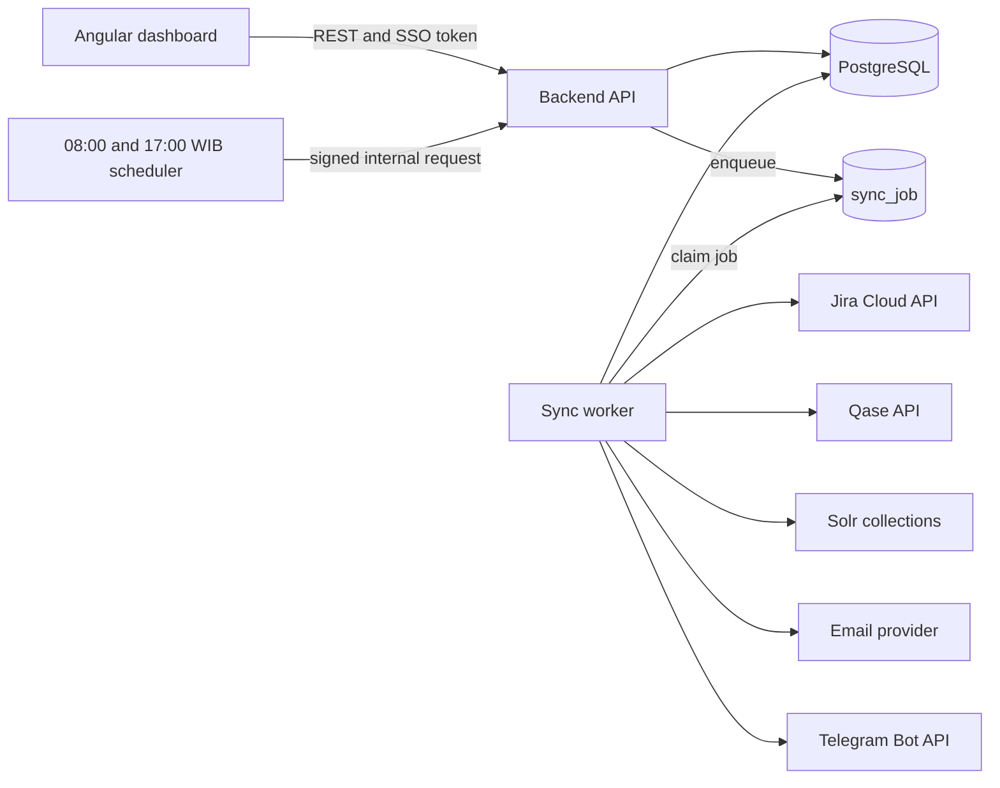
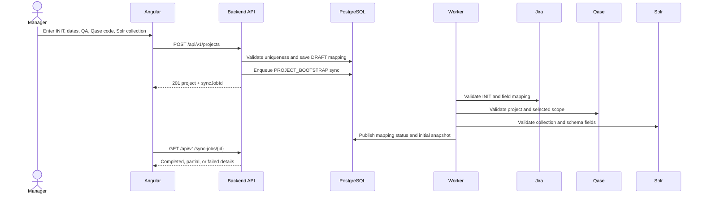
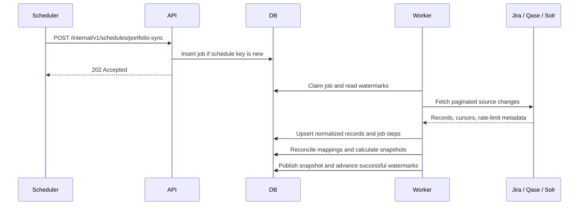
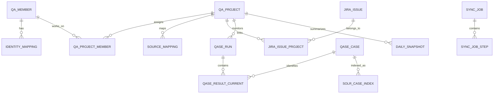

# QA Monitoring Dashboard Backend Technical Design

> Historical broader proposal. For the current Go + PostgreSQL + Redis + Jira + Qase MVP, use [BACKEND-MVP-GO.md](./BACKEND-MVP-GO.md) as the implementation baseline. Solr/RAG and notification modules below are future scope.

**Status:** Historical broader proposal; superseded for the current MVP by [BACKEND-MVP-GO.md](./BACKEND-MVP-GO.md)  
**Audience:** Backend engineers, QA platform owners, DevOps, security reviewers, and frontend engineers  
**Related document:** [Product Requirements Document](./PRD-QA-Monitoring-Dashboard.md)

## 1. Purpose

This document defines the backend for the QA Monitoring Dashboard. The backend consolidates Jira initiatives and bugs, Qase projects and execution results, Solr knowledge coverage, QA assignments, workload, snapshots, and notification history into one controlled read model.

The dashboard must render from PostgreSQL. Angular must never call Jira, Qase, or Solr directly. External systems are synchronized at **08:00 and 17:00 Asia/Jakarta**, and a QA Manager can request an additional synchronization from a **Sync data** button. The button queues a background job; it does not block the browser or bypass rate limits.

## 2. Decisions and scope

| Area             | Decision                                                        |
| ---------------- | --------------------------------------------------------------- |
| Backend style    | Modular monolith with a separate worker process                 |
| HTTP API         | REST under `/api/v1`                                            |
| Primary database | PostgreSQL 15 or later                                          |
| Job queue        | PostgreSQL job table with `FOR UPDATE SKIP LOCKED`              |
| Scheduler        | Platform scheduler or Kubernetes CronJob at 08:00 and 17:00 WIB |
| Read behavior    | Dashboard endpoints read stored data only                       |
| Source access    | Backend-only credentials with least privilege                   |
| Sync behavior    | Incremental where reliable; bounded reconciliation otherwise    |
| Manual sync      | Manager/Admin only, deduplicated and protected by cooldown      |
| Time storage     | UTC in PostgreSQL; display in `Asia/Jakarta`                    |
| API timestamps   | ISO 8601 UTC, for example `2026-09-13T01:00:00Z`                |

This design does not make Jira, Qase, or Solr subordinate to the dashboard. They remain systems of record. PostgreSQL contains mappings, normalized copies, job state, dashboard aggregates, and audit data.

## 3. System architecture



### 3.1 Runtime modules

| Module               | Responsibility                                                              |
| -------------------- | --------------------------------------------------------------------------- |
| Identity and access  | Verify SSO token, resolve roles, enforce project-level access               |
| Project registry     | Store INIT, timeline, QA ownership, Qase scope, and Solr mapping            |
| Dashboard query      | Return overview, project, QA, workload, bug, Qase, and RAG read models      |
| Sync orchestration   | Validate, enqueue, deduplicate, schedule, retry, and publish jobs           |
| Jira connector       | Read initiatives, linked bugs, users, fields, and statuses                  |
| Qase connector       | Read projects, cases, runs, results, members, and defects                   |
| Solr connector       | Read case-index manifests and optionally write knowledge chunks             |
| Snapshot service     | Calculate consistent portfolio and daily aggregates                         |
| Notification service | Queue, send, and audit email or Telegram messages                           |
| Health and audit     | Expose source freshness, job failures, metrics, and immutable audit records |

### 3.2 Deployment units

Use the same codebase with two entry points:

1. `api` serves `/api/v1`, health checks, and internal scheduler requests.
2. `worker` claims queued jobs and performs external I/O.

Run at least one worker. Multiple workers are safe because a worker claims rows with `FOR UPDATE SKIP LOCKED`. A database advisory lock prevents two portfolio syncs for the same source and scope from running together.

## 4. Data flow and workflows

### 4.1 Register a QA project



The project is visible immediately as `DRAFT` or `PENDING_VALIDATION`. It becomes `ACTIVE` only after the required Jira and Qase mappings pass. A missing optional Solr mapping disables RAG metrics without blocking the other dashboard modules.

### 4.2 Read dashboard data

1. Angular calls a dashboard endpoint.
2. The API verifies the user and applies project-level access.
3. The API reads normalized data or the latest published snapshot from PostgreSQL.
4. The response includes `asOf`, source freshness, active filters, denominator, and unknown counts.
5. No upstream API is called during this request.

This guarantees predictable latency and prevents each page refresh from consuming Jira, Qase, or Solr capacity.

### 4.3 Scheduled synchronization



Schedule configuration:

```text
Timezone: Asia/Jakarta
Morning sync:  0 8 * * *
Evening sync:  0 17 * * *
```

Store the timezone beside the schedule. If the infrastructure scheduler accepts UTC only, generate UTC schedules from `Asia/Jakarta` in deployment configuration rather than hard-coding an offset in application code.

### 4.4 Manual Sync data button

The overview header should contain one **Sync data** button beside the current snapshot time. Selecting it opens a small dialog with:

- Scope: all active projects or the currently selected project.
- Sources: Jira, Qase, and Solr, selected by default.
- Last successful sync time for each source.
- A warning when the cooldown is still active.

Button behavior:

1. Angular sends `POST /api/v1/sync-jobs` with an idempotency key.
2. The API checks `QA_MANAGER` or `ADMIN` permission.
3. The API returns an existing queued/running equivalent job when one exists.
4. The API rejects a redundant request during the 15-minute cooldown with `409 SYNC_COOLDOWN_ACTIVE`, including `retryAt`.
5. Otherwise, it creates one parent job and one step for each selected source.
6. Angular receives `202 Accepted`, disables the button, and polls the job every 3 seconds for the first 30 seconds, then every 10 seconds.
7. Completion refreshes dashboard queries from PostgreSQL and shows the new `asOf` value.
8. Closing or reloading the page does not cancel the job.

Manual and scheduled requests execute the same worker code. A manual job never receives a higher retry limit and cannot create concurrent work for the same source and scope.

### 4.5 Per-source worker sequence

For every source step, the worker must:

1. Load the connection and scope without exposing secrets in logs.
2. Mark the step `RUNNING` and record `started_at`.
3. Load the last successful cursor or watermark.
4. Request only required fields and paginate until complete.
5. Normalize identifiers and timestamps.
6. Upsert by immutable external ID.
7. Mark records missing from a complete reconciliation as inactive, never hard delete them.
8. Calculate validation and reconciliation counts.
9. Mark the step `SUCCEEDED`, `PARTIAL`, or `FAILED`.
10. Advance the cursor only after that scope is completely committed.

After all required steps finish, the worker builds and publishes a snapshot. If one source fails, the job becomes `PARTIAL`; the last valid data for that source remains visible and is marked stale.

## 5. Synchronization policy

### 5.1 Job states

`QUEUED -> RUNNING -> SUCCEEDED | PARTIAL | FAILED | CANCELLED`

A worker heartbeat updates every 30 seconds. A watchdog returns a job to `QUEUED` when its worker heartbeat is more than 5 minutes old and `attempt_count < max_attempts`.

### 5.2 Idempotency and deduplication

- API clients send `Idempotency-Key` for manual jobs.
- Scheduled jobs use `schedule:{yyyy-mm-dd}:{08|17}:Asia/Jakarta`.
- A unique constraint covers `(request_key)`.
- Upserts use each source's immutable ID, not display names.
- Qase current result identity is `(project_code, run_id, case_id, configuration_key)` when configuration exists.
- Solr case identity is `(collection_name, qase_project_code, qase_case_id)`.
- Jira issue identity is Jira's immutable issue ID; the issue key may change.

### 5.3 Incremental windows

| Source       | Incremental approach                                                                                                | Reconciliation                                       |
| ------------ | ------------------------------------------------------------------------------------------------------------------- | ---------------------------------------------------- |
| Jira         | JQL on `updated` with a 5-minute overlap; stable sort by `updated, id`                                              | All mapped active INITs and linked bugs each evening |
| Qase results | `from_end_time` overlap for completed results; explicitly refresh active runs                                       | Cases and active run scope each evening              |
| Qase cases   | Fetch all cases for mapped active project codes at each scheduled sync unless a verified change cursor is available | Every scheduled sync                                 |
| Solr         | Query canonical case and version fields for mapped collections                                                      | Every scheduled sync                                 |

Never advance a watermark after only part of the pagination succeeds. Deduplication makes overlap safe.

### 5.4 Rate limits and retries

- Respect `Retry-After` and source-specific rate-limit headers.
- Retry HTTP `429`, `502`, `503`, and `504` with exponential backoff and jitter.
- Default attempts: 4, with delays near 2, 5, 15, and 30 seconds.
- Do not retry `400`, `401`, `403`, or mapping validation errors automatically.
- Cap connector concurrency independently; start with Jira 2, Qase 2, and Solr 4 requests.
- Emit a warning at 70% of the known quota and stop optional reconciliation at 90%.

## 6. REST API contract

### 6.1 Conventions

- Base path: `/api/v1`
- Media type: `application/json`
- Authentication: company SSO bearer token
- Pagination: opaque `cursor` and `limit`, maximum 100
- Filtering: query parameters; dates use `YYYY-MM-DD`
- Request tracing: accept or generate `X-Request-Id`
- Mutating requests: support `Idempotency-Key`

Successful list response:

```json
{
  "data": [],
  "meta": {
    "asOf": "2026-09-13T10:00:00Z",
    "nextCursor": null,
    "sources": {
      "jira": { "status": "fresh", "syncedAt": "2026-09-13T10:00:00Z" },
      "qase": { "status": "fresh", "syncedAt": "2026-09-13T10:01:22Z" },
      "solr": { "status": "stale", "syncedAt": "2026-09-13T01:03:04Z" }
    }
  }
}
```

Error response:

```json
{
  "error": {
    "code": "SYNC_COOLDOWN_ACTIVE",
    "message": "A matching synchronization completed recently.",
    "requestId": "req_01J...",
    "details": { "retryAt": "2026-09-13T10:20:00Z" }
  }
}
```

### 6.2 Endpoint catalog

| Method  | Path                            | Role            | Purpose                                                 |
| ------- | ------------------------------- | --------------- | ------------------------------------------------------- |
| `GET`   | `/overview`                     | Viewer          | Portfolio KPIs, priorities, and source freshness        |
| `GET`   | `/projects`                     | Viewer          | Filtered projects and timeline health                   |
| `POST`  | `/projects`                     | Manager         | Register a Jira INIT and external mappings              |
| `GET`   | `/projects/{projectId}`         | Viewer          | Full project detail                                     |
| `PATCH` | `/projects/{projectId}`         | Manager         | Change dates, QA assignment, thresholds, or scope       |
| `POST`  | `/projects/{projectId}/archive` | Manager         | Stop monitoring without deleting history                |
| `GET`   | `/qa-members`                   | Viewer          | Team workload summary                                   |
| `GET`   | `/qa-members/{memberId}`        | Viewer          | QA statistics, bugs, projects, forecast, and trend      |
| `GET`   | `/qase/runs`                    | Viewer          | Stored active run progress and stalled cases            |
| `GET`   | `/bugs`                         | Viewer          | Stored Jira bugs by INIT, creator, severity, and status |
| `GET`   | `/knowledge/collections`        | Viewer          | Solr coverage, freshness, and errors                    |
| `GET`   | `/documentation-matrix`         | Viewer          | Project document readiness                              |
| `POST`  | `/sync-jobs`                    | Manager         | Queue a manual synchronization                          |
| `GET`   | `/sync-jobs/{jobId}`            | Viewer          | Read job and source-step progress                       |
| `GET`   | `/sync-status`                  | Viewer          | Last/next sync and active cooldown by source            |
| `POST`  | `/notifications/preview`        | Manager         | Preview a notification                                  |
| `POST`  | `/notifications`                | Manager         | Queue an approved notification                          |
| `GET`   | `/health/live`                  | Public/internal | Process liveness                                        |
| `GET`   | `/health/ready`                 | Internal        | Database and worker readiness                           |

### 6.3 Create project

`POST /api/v1/projects`

```json
{
  "jiraInitKey": "INIT-2401",
  "qaStartDate": "2026-09-01",
  "qaEndDate": "2026-09-21",
  "qaMemberIds": ["7e9b05d2-99a7-42cc-a82a-a244b13ffb44"],
  "qase": {
    "projectCode": "PAY",
    "runIds": [181, 182],
    "suiteIds": []
  },
  "solr": {
    "collection": "tc_payment",
    "enabled": true
  }
}
```

Return `201 Created` with project status `PENDING_VALIDATION` and the bootstrap `syncJobId`. Return `409` for an active duplicate INIT mapping and `422` for invalid date or scope combinations.

### 6.4 Queue manual synchronization

`POST /api/v1/sync-jobs`

```http
Idempotency-Key: 9d02eed1-96fa-4776-aa3d-412c9fbfd913
```

```json
{
  "scope": { "type": "PROJECT", "projectId": "3bd..." },
  "sources": ["JIRA", "QASE", "SOLR"],
  "reason": "Manager requested fresh data before the QA review"
}
```

Response:

```json
{
  "data": {
    "jobId": "c51...",
    "status": "QUEUED",
    "requestedAt": "2026-09-13T10:04:15Z",
    "pollUrl": "/api/v1/sync-jobs/c51..."
  }
}
```

### 6.5 Read sync status

`GET /api/v1/sync-status?projectId=3bd...`

```json
{
  "data": {
    "activeJob": null,
    "nextScheduledAt": "2026-09-13T10:00:00Z",
    "sources": [
      {
        "source": "JIRA",
        "status": "FRESH",
        "lastSucceededAt": "2026-09-13T01:01:11Z",
        "cooldownUntil": "2026-09-13T01:16:11Z"
      }
    ]
  }
}
```

## 7. PostgreSQL schema

### 7.1 Entity relationship model



### 7.2 Reference DDL

The following schema is the implementation baseline. Migration tooling may split it into ordered files without changing keys or invariants.

```sql
CREATE EXTENSION IF NOT EXISTS pgcrypto;

CREATE TABLE app_user (
  id uuid PRIMARY KEY DEFAULT gen_random_uuid(),
  subject varchar(255) NOT NULL UNIQUE,
  email varchar(320) NOT NULL,
  display_name varchar(160) NOT NULL,
  role varchar(20) NOT NULL CHECK (role IN ('VIEWER', 'QA', 'QA_MANAGER', 'ADMIN')),
  active boolean NOT NULL DEFAULT true,
  created_at timestamptz NOT NULL DEFAULT now(),
  updated_at timestamptz NOT NULL DEFAULT now()
);

CREATE TABLE qa_member (
  id uuid PRIMARY KEY DEFAULT gen_random_uuid(),
  display_name varchar(160) NOT NULL,
  email varchar(320),
  team varchar(120),
  title varchar(120),
  weekly_capacity_hours numeric(6,2) NOT NULL DEFAULT 40 CHECK (weekly_capacity_hours >= 0),
  active boolean NOT NULL DEFAULT true,
  created_at timestamptz NOT NULL DEFAULT now(),
  updated_at timestamptz NOT NULL DEFAULT now()
);

CREATE TABLE identity_mapping (
  id uuid PRIMARY KEY DEFAULT gen_random_uuid(),
  qa_member_id uuid NOT NULL REFERENCES qa_member(id),
  source varchar(20) NOT NULL CHECK (source IN ('JIRA', 'QASE', 'DIRECTORY', 'TELEGRAM')),
  external_id varchar(255) NOT NULL,
  external_display_name varchar(255),
  verified_at timestamptz,
  active boolean NOT NULL DEFAULT true,
  UNIQUE (source, external_id),
  UNIQUE (qa_member_id, source)
);

CREATE TABLE qa_project (
  id uuid PRIMARY KEY DEFAULT gen_random_uuid(),
  jira_init_id varchar(64),
  jira_init_key varchar(32) NOT NULL,
  name varchar(255),
  qa_start_date date NOT NULL,
  qa_end_date date NOT NULL,
  baseline_start_date date,
  baseline_end_date date,
  status varchar(30) NOT NULL DEFAULT 'PENDING_VALIDATION'
    CHECK (status IN ('DRAFT', 'PENDING_VALIDATION', 'ACTIVE', 'ON_HOLD', 'COMPLETED', 'ARCHIVED')),
  stalled_hours integer NOT NULL DEFAULT 24 CHECK (stalled_hours > 0),
  created_by uuid NOT NULL REFERENCES app_user(id),
  created_at timestamptz NOT NULL DEFAULT now(),
  updated_at timestamptz NOT NULL DEFAULT now(),
  CHECK (qa_end_date >= qa_start_date)
);

CREATE UNIQUE INDEX uq_active_jira_init
  ON qa_project (jira_init_key)
  WHERE status <> 'ARCHIVED';

CREATE TABLE qa_project_member (
  project_id uuid NOT NULL REFERENCES qa_project(id),
  qa_member_id uuid NOT NULL REFERENCES qa_member(id),
  allocation_percent numeric(5,2) NOT NULL DEFAULT 100
    CHECK (allocation_percent > 0 AND allocation_percent <= 100),
  is_lead boolean NOT NULL DEFAULT false,
  assigned_from date NOT NULL,
  assigned_until date,
  PRIMARY KEY (project_id, qa_member_id, assigned_from),
  CHECK (assigned_until IS NULL OR assigned_until >= assigned_from)
);

CREATE TABLE source_connection (
  id uuid PRIMARY KEY DEFAULT gen_random_uuid(),
  source varchar(20) NOT NULL CHECK (source IN ('JIRA', 'QASE', 'SOLR', 'EMAIL', 'TELEGRAM')),
  name varchar(100) NOT NULL,
  base_url text NOT NULL,
  auth_type varchar(30) NOT NULL,
  secret_ref text NOT NULL,
  enabled boolean NOT NULL DEFAULT true,
  config jsonb NOT NULL DEFAULT '{}'::jsonb,
  last_health_at timestamptz,
  last_health_status varchar(20),
  UNIQUE (source, name)
);

CREATE TABLE source_mapping (
  id uuid PRIMARY KEY DEFAULT gen_random_uuid(),
  project_id uuid NOT NULL REFERENCES qa_project(id),
  source varchar(20) NOT NULL CHECK (source IN ('JIRA', 'QASE', 'SOLR')),
  external_project_id varchar(255),
  external_project_key varchar(100),
  scope jsonb NOT NULL DEFAULT '{}'::jsonb,
  validation_status varchar(20) NOT NULL DEFAULT 'PENDING'
    CHECK (validation_status IN ('PENDING', 'VALID', 'INVALID', 'DISABLED')),
  validation_error text,
  validated_at timestamptz,
  UNIQUE (project_id, source)
);

CREATE TABLE jira_issue (
  jira_issue_id varchar(64) PRIMARY KEY,
  issue_key varchar(32) NOT NULL,
  issue_type varchar(80) NOT NULL,
  summary text NOT NULL,
  status_id varchar(64),
  status_name varchar(120),
  severity varchar(20) NOT NULL DEFAULT 'UNKNOWN'
    CHECK (severity IN ('BLOCKER', 'CRITICAL', 'MAJOR', 'MINOR', 'TRIVIAL', 'UNKNOWN')),
  creator_account_id varchar(255),
  reporter_account_id varchar(255),
  assignee_account_id varchar(255),
  resolution varchar(120),
  source_created_at timestamptz,
  source_updated_at timestamptz NOT NULL,
  raw_hash char(64) NOT NULL,
  active boolean NOT NULL DEFAULT true,
  synced_at timestamptz NOT NULL
);

CREATE UNIQUE INDEX uq_jira_issue_key ON jira_issue (issue_key);
CREATE INDEX ix_jira_issue_updated ON jira_issue (source_updated_at);
CREATE INDEX ix_jira_issue_creator ON jira_issue (creator_account_id);

CREATE TABLE jira_issue_project (
  jira_issue_id varchar(64) NOT NULL REFERENCES jira_issue(jira_issue_id),
  project_id uuid NOT NULL REFERENCES qa_project(id),
  relation_type varchar(40) NOT NULL,
  relation_evidence jsonb NOT NULL,
  PRIMARY KEY (jira_issue_id, project_id)
);

CREATE TABLE qase_case (
  project_code varchar(20) NOT NULL,
  case_id bigint NOT NULL,
  title text NOT NULL,
  suite_id bigint,
  severity varchar(40),
  priority varchar(40),
  automation_status varchar(40),
  source_updated_at timestamptz,
  content_hash char(64),
  active boolean NOT NULL DEFAULT true,
  synced_at timestamptz NOT NULL,
  PRIMARY KEY (project_code, case_id)
);

CREATE TABLE qase_run (
  project_code varchar(20) NOT NULL,
  run_id bigint NOT NULL,
  project_id uuid REFERENCES qa_project(id),
  title text NOT NULL,
  status varchar(40) NOT NULL,
  environment_id bigint,
  started_at timestamptz,
  ended_at timestamptz,
  source_updated_at timestamptz,
  synced_at timestamptz NOT NULL,
  PRIMARY KEY (project_code, run_id)
);

CREATE INDEX ix_qase_run_project ON qase_run (project_id, status);

CREATE TABLE qase_result_history (
  id uuid PRIMARY KEY DEFAULT gen_random_uuid(),
  project_code varchar(20) NOT NULL,
  run_id bigint NOT NULL,
  case_id bigint NOT NULL,
  result_external_id varchar(100) NOT NULL,
  configuration_key varchar(255) NOT NULL DEFAULT '',
  status varchar(40) NOT NULL,
  member_external_id varchar(255),
  defect_refs jsonb NOT NULL DEFAULT '[]'::jsonb,
  started_at timestamptz,
  ended_at timestamptz,
  duration_ms bigint,
  source_updated_at timestamptz,
  synced_at timestamptz NOT NULL,
  UNIQUE (project_code, result_external_id),
  FOREIGN KEY (project_code, run_id) REFERENCES qase_run(project_code, run_id),
  FOREIGN KEY (project_code, case_id) REFERENCES qase_case(project_code, case_id)
);

CREATE TABLE qase_result_current (
  project_code varchar(20) NOT NULL,
  run_id bigint NOT NULL,
  case_id bigint NOT NULL,
  configuration_key varchar(255) NOT NULL DEFAULT '',
  result_history_id uuid NOT NULL REFERENCES qase_result_history(id),
  status varchar(40) NOT NULL,
  last_activity_at timestamptz,
  stalled_since timestamptz,
  PRIMARY KEY (project_code, run_id, case_id, configuration_key)
);

CREATE TABLE solr_case_index (
  collection_name varchar(160) NOT NULL,
  qase_project_code varchar(20) NOT NULL,
  qase_case_id bigint NOT NULL,
  source_version varchar(255),
  source_content_hash char(64),
  indexed_content_hash char(64),
  ingestion_status varchar(30) NOT NULL
    CHECK (ingestion_status IN ('QUEUED', 'PROCESSING', 'COMPLETE', 'FAILED', 'UNKNOWN')),
  chunk_count integer CHECK (chunk_count >= 0),
  expected_chunk_count integer CHECK (expected_chunk_count >= 0),
  indexed_at timestamptz,
  observed_at timestamptz NOT NULL,
  PRIMARY KEY (collection_name, qase_project_code, qase_case_id)
);

CREATE TABLE sync_job (
  id uuid PRIMARY KEY DEFAULT gen_random_uuid(),
  request_key varchar(255) NOT NULL UNIQUE,
  trigger_type varchar(20) NOT NULL CHECK (trigger_type IN ('SCHEDULED', 'MANUAL', 'BOOTSTRAP', 'RETRY')),
  scope_type varchar(20) NOT NULL CHECK (scope_type IN ('PORTFOLIO', 'PROJECT')),
  project_id uuid REFERENCES qa_project(id),
  status varchar(20) NOT NULL DEFAULT 'QUEUED'
    CHECK (status IN ('QUEUED', 'RUNNING', 'SUCCEEDED', 'PARTIAL', 'FAILED', 'CANCELLED')),
  requested_by uuid REFERENCES app_user(id),
  reason varchar(500),
  priority smallint NOT NULL DEFAULT 100,
  available_at timestamptz NOT NULL DEFAULT now(),
  attempt_count smallint NOT NULL DEFAULT 0,
  max_attempts smallint NOT NULL DEFAULT 3,
  worker_id varchar(255),
  heartbeat_at timestamptz,
  requested_at timestamptz NOT NULL DEFAULT now(),
  started_at timestamptz,
  completed_at timestamptz,
  error_code varchar(100),
  error_message text,
  CHECK ((scope_type = 'PROJECT' AND project_id IS NOT NULL) OR scope_type = 'PORTFOLIO')
);

CREATE INDEX ix_sync_job_claim
  ON sync_job (status, available_at, priority, requested_at)
  WHERE status = 'QUEUED';

CREATE TABLE sync_job_step (
  id uuid PRIMARY KEY DEFAULT gen_random_uuid(),
  job_id uuid NOT NULL REFERENCES sync_job(id) ON DELETE CASCADE,
  source varchar(20) NOT NULL CHECK (source IN ('JIRA', 'QASE', 'SOLR', 'SNAPSHOT')),
  status varchar(20) NOT NULL DEFAULT 'QUEUED'
    CHECK (status IN ('QUEUED', 'RUNNING', 'SUCCEEDED', 'PARTIAL', 'FAILED', 'SKIPPED')),
  records_read bigint NOT NULL DEFAULT 0,
  records_written bigint NOT NULL DEFAULT 0,
  records_rejected bigint NOT NULL DEFAULT 0,
  page_cursor text,
  started_at timestamptz,
  completed_at timestamptz,
  error_code varchar(100),
  error_message text,
  metrics jsonb NOT NULL DEFAULT '{}'::jsonb,
  UNIQUE (job_id, source)
);

CREATE TABLE sync_cursor (
  source varchar(20) NOT NULL,
  scope_key varchar(255) NOT NULL,
  watermark timestamptz,
  cursor text,
  last_job_id uuid REFERENCES sync_job(id),
  updated_at timestamptz NOT NULL DEFAULT now(),
  PRIMARY KEY (source, scope_key)
);

CREATE TABLE daily_snapshot (
  id uuid PRIMARY KEY DEFAULT gen_random_uuid(),
  project_id uuid REFERENCES qa_project(id),
  snapshot_date date NOT NULL,
  as_of timestamptz NOT NULL,
  execution_total integer NOT NULL DEFAULT 0,
  execution_completed integer NOT NULL DEFAULT 0,
  passed integer NOT NULL DEFAULT 0,
  failed integer NOT NULL DEFAULT 0,
  blocked integer NOT NULL DEFAULT 0,
  stalled integer NOT NULL DEFAULT 0,
  open_bugs integer NOT NULL DEFAULT 0,
  critical_bugs integer NOT NULL DEFAULT 0,
  rag_expected_cases integer NOT NULL DEFAULT 0,
  rag_fresh_cases integer NOT NULL DEFAULT 0,
  workload_hours numeric(8,2) NOT NULL DEFAULT 0,
  source_freshness jsonb NOT NULL,
  calculation_version varchar(40) NOT NULL,
  UNIQUE (project_id, snapshot_date, calculation_version)
);

CREATE TABLE notification_delivery (
  id uuid PRIMARY KEY DEFAULT gen_random_uuid(),
  project_id uuid REFERENCES qa_project(id),
  qa_member_id uuid REFERENCES qa_member(id),
  channel varchar(20) NOT NULL CHECK (channel IN ('EMAIL', 'TELEGRAM')),
  template_key varchar(100) NOT NULL,
  payload jsonb NOT NULL,
  status varchar(20) NOT NULL CHECK (status IN ('QUEUED', 'SENT', 'FAILED', 'CANCELLED')),
  requested_by uuid REFERENCES app_user(id),
  requested_at timestamptz NOT NULL DEFAULT now(),
  sent_at timestamptz,
  provider_message_id varchar(255),
  error_message text
);

CREATE TABLE audit_event (
  id uuid PRIMARY KEY DEFAULT gen_random_uuid(),
  actor_user_id uuid REFERENCES app_user(id),
  action varchar(100) NOT NULL,
  entity_type varchar(80) NOT NULL,
  entity_id varchar(255) NOT NULL,
  request_id varchar(100),
  before_value jsonb,
  after_value jsonb,
  created_at timestamptz NOT NULL DEFAULT now()
);
```

### 7.3 Retention

| Data                       | Retention                                             |
| -------------------------- | ----------------------------------------------------- |
| Current normalized records | While mapped plus 180 days after archive              |
| Qase result history        | 13 months                                             |
| Daily snapshots            | 24 months                                             |
| Sync jobs and steps        | 90 days                                               |
| Audit events               | At least 12 months or company policy                  |
| Notification payloads      | 90 days; redact secrets and unnecessary personal data |

## 8. Jira integration

### 8.1 Authentication

For Jira Cloud, use OAuth 2.0 authorization code grant when dashboard permissions must follow the authorizing user's Jira permissions. Atlassian recommends OAuth 2.0 3LO for most external integrations. Request only the scopes required by the chosen operations; the classic read scope for issue search is `read:jira-work`. For unattended scheduled synchronization, request offline access, store the rotating refresh token in the company secret manager, and replace it atomically after every refresh.

An approved read-only service account may be used for a single internal tenant when portfolio visibility is intentionally broader than individual Jira visibility. Basic authentication with an API token is acceptable only for that controlled internal integration. Never store tokens in PostgreSQL or Angular configuration.

Configuration:

```text
JIRA_BASE_URL=https://gli.atlassian.net
JIRA_AUTH_MODE=oauth_3lo
JIRA_CLIENT_ID=<secret reference>
JIRA_CLIENT_SECRET=<secret reference>
JIRA_REFRESH_TOKEN=<secret reference>
JIRA_CLOUD_ID=<resolved tenant id>
JIRA_INIT_ISSUE_TYPE_ID=<configured id>
JIRA_SEVERITY_FIELD_ID=customfield_xxxxx
JIRA_INIT_LINK_FIELD_ID=customfield_yyyyy
```

### 8.2 Required field contract

Agree these values with the Jira administrator before implementation:

- INIT issue type ID and allowed lifecycle statuses.
- Bug issue type IDs.
- Bug-to-INIT relationship: parent, issue link type, or a specific custom field.
- Severity custom field and accepted values.
- QA creator identity: `creator.accountId`; reporter and assignee remain separate.
- Canceled and duplicate resolution values.
- Saved filter or approved JQL that replaces dashboard gadget `10142`.

### 8.3 API usage

- Validate an INIT with `GET /rest/api/3/issue/{issueIdOrKey}` and request only configured fields.
- Search changes with enhanced JQL search `POST /rest/api/3/search/jql`.
- Use `nextPageToken` until absent.
- Keep JQL bounded by mapped projects and an `updated` watermark.
- Preserve Jira issue ID as the primary key and issue key as mutable display data.

Example JQL template:

```text
updated >= "2026-09-13 07:55"
AND (
  key in (INIT-2401, INIT-2402)
  OR "Parent Initiative" in (INIT-2401, INIT-2402)
  OR issueFunction in linkedIssuesOf("key in (INIT-2401, INIT-2402)")
)
ORDER BY updated ASC, id ASC
```

The exact relationship clause must match installed Jira capabilities. Do not use `issueFunction` unless ScriptRunner or an equivalent extension is confirmed.

## 9. Qase integration

### 9.1 Authentication

Create a dedicated Qase app token or service token with read access only to monitored projects. Qase expects the key in the `Token: API_TOKEN` header and requires HTTPS. Store it in the secret manager. Rate limits apply to the workspace and are shared across its tokens, so creating more tokens does not create more capacity.

```text
QASE_BASE_URL=https://api.qase.io
QASE_API_TOKEN=<secret reference>
```

### 9.2 API usage

| Data    | Endpoint                | Notes                                                         |
| ------- | ----------------------- | ------------------------------------------------------------- |
| Cases   | `GET /v1/case/{code}`   | Page with `limit=100` and `offset`                            |
| Runs    | `GET /v1/run/{code}`    | Filter active/in-progress runs; page with limit and offset    |
| Results | `GET /v1/result/{code}` | Filter by run and `from_end_time`; page with limit and offset |

For runs, Qase documents a maximum page size of 100. For results, preserve the result history and separately upsert the latest result for each run, case, and configuration. Refresh every active run on both scheduled syncs even when no completed-result watermark changed, because a running or not-run case may not have a final timestamp.

Stalled classification is calculated after synchronization:

```text
stalled = planned_start_has_passed
          AND current_status IN (NOT_RUN, IN_PROGRESS, BLOCKED)
          AND last_activity_at < as_of - project.stalled_hours
          AND qase_source_is_not_stale
```

If Qase is unavailable, retain the previous classification and mark the metric `UNKNOWN` or stale. Do not create new stalled labels from old data.

## 10. Solr and RAG integration

### 10.1 Connection and security

Solr must be reachable only from trusted backend or worker networks. Enable TLS plus an authentication and authorization plugin. Create a read-only role for coverage queries and a separate writer role only if this application owns RAG ingestion. Do not expose the Solr Admin UI or credentials to the browser.

```text
SOLR_BASE_URL=https://solr.internal.example
SOLR_AUTH_MODE=basic_or_jwt
SOLR_READ_SECRET=<secret reference>
SOLR_WRITE_SECRET=<optional secret reference>
SOLR_REQUEST_TIMEOUT_MS=10000
```

### 10.2 Collection contract

Each knowledge chunk should contain these fields:

| Field                   | Type         | Required | Meaning                               |
| ----------------------- | ------------ | -------- | ------------------------------------- |
| `id`                    | string       | Yes      | Unique chunk ID                       |
| `qase_project_code_s`   | string       | Yes      | Canonical Qase project code           |
| `qase_case_id_l`        | long         | Yes      | Canonical Qase case ID                |
| `chunk_index_i`         | integer      | Yes      | Zero-based chunk position             |
| `chunk_count_i`         | integer      | Yes      | Expected chunks for the case version  |
| `source_updated_at_dt`  | date         | Yes      | Qase/source update time               |
| `source_content_hash_s` | string       | Yes      | Hash of normalized source content     |
| `ingestion_status_s`    | string       | Yes      | `COMPLETE`, `PROCESSING`, or `FAILED` |
| `indexed_at_dt`         | date         | Yes      | Successful index time                 |
| `content_t`             | text         | Yes      | Searchable chunk text                 |
| `embedding_v`           | dense vector | Optional | Vector generated outside Solr         |

Use one collection per QA domain when access control, lifecycle, or scale differs. Use a shared collection with a domain field when policies are identical and the operating team prefers fewer collections. Store the chosen collection per QA project in `source_mapping`.

### 10.3 Coverage query

Coverage counts unique Qase cases, not Solr documents or chunks.

For each active Qase case:

- `FRESH`: at least one complete manifest exists and indexed hash/version matches Qase.
- `OUTDATED`: a complete manifest exists but its hash/version is older.
- `MISSING`: Solr query succeeded and no matching manifest exists.
- `PROCESSING`: an ingestion manifest is queued or running.
- `FAILED`: the last ingestion manifest failed.
- `UNKNOWN`: Solr failed, mapping is invalid, or required fields are absent.

Query only the canonical fields and group by project and case ID. Use cursor-based pagination for large collections. A failed Solr request must never turn all cases into `MISSING`.

### 10.4 Optional ingestion workflow

If this backend owns knowledge ingestion:

1. Read the active Qase case and related approved documentation.
2. Normalize content and calculate a source hash.
3. Split content into deterministic chunks.
4. Generate embeddings outside Solr.
5. Upsert JSON documents to `/{collection}/update` or `/update/json/docs` with overwrite enabled.
6. Commit within the agreed visibility window.
7. Write a `COMPLETE` manifest only after all expected chunks are queryable.

Solr supports JSON update handlers for adding and updating documents. Ingestion is a separate job type from coverage synchronization so a manager's Sync data request does not unexpectedly regenerate embeddings.

## 11. Snapshot calculations

All percentages must return numerator, denominator, and unknown count.

```text
execution_progress = completed_test_instances / planned_test_instances * 100
rag_fresh_coverage = fresh_unique_qase_cases / active_unique_qase_cases * 100
capacity_load = assigned_hours / available_hours * 100
timeline_confidence = bounded rule score from pace, blocked ratio, and schedule health
```

Timeline confidence is an explainable operational indicator, not a machine-learning prediction. Store its calculation version and contributing values in the snapshot so historical figures remain reproducible.

Publish the new snapshot only after calculations finish. API readers use the last published snapshot ID, which prevents mixed data from a partially completed synchronization.

## 12. Authentication, authorization, and secrets

| Action                         | Viewer |  QA | QA Manager | Admin |
| ------------------------------ | -----: | --: | ---------: | ----: |
| View permitted dashboard data  |    Yes | Yes |        Yes |   Yes |
| View QA detail                 |    Yes | Yes |        Yes |   Yes |
| Create or edit project mapping |     No |  No |        Yes |   Yes |
| Trigger manual sync            |     No |  No |        Yes |   Yes |
| Send notification              |     No |  No |        Yes |   Yes |
| Configure source connection    |     No |  No |         No |   Yes |

- Validate SSO bearer tokens by issuer, audience, signature, expiry, and nonce where applicable.
- Keep source secrets in Vault, AWS Secrets Manager, GCP Secret Manager, or the approved equivalent.
- Store only `secret_ref` in PostgreSQL.
- Redact authorization headers, tokens, notification destinations, and source payloads from logs.
- Encrypt database connections and all upstream traffic with TLS.
- Apply project-level authorization before aggregation, export, or detail retrieval.
- Audit project changes, sync triggers, connection changes, and notification sends.

## 13. Observability and operations

### 13.1 Metrics

- `sync_jobs_total{source,status,trigger}`
- `sync_duration_seconds{source}`
- `sync_records_total{source,operation}`
- `upstream_requests_total{source,status}`
- `upstream_rate_limit_total{source}`
- `source_freshness_seconds{source,scope}`
- `job_queue_age_seconds`
- `snapshot_publish_total{status}`
- `notification_total{channel,status}`

### 13.2 Structured log fields

`timestamp`, `level`, `requestId`, `jobId`, `stepId`, `source`, `scopeKey`, `projectId`, `attempt`, `durationMs`, `recordsRead`, `recordsWritten`, `errorCode`.

Do not log whole Jira descriptions, Qase test content, Solr chunks, or API response bodies in production.

### 13.3 Alerts

- Morning or evening portfolio job has not started within 10 minutes.
- Job remains running for more than 30 minutes.
- Source has no successful sync for more than 18 hours.
- Queue oldest age exceeds 10 minutes.
- Three consecutive source steps fail.
- Reconciliation count changes by more than the configured threshold.

## 14. Failure handling

| Failure                    | Backend behavior                                    | Dashboard behavior                                   |
| -------------------------- | --------------------------------------------------- | ---------------------------------------------------- |
| Jira/Qase `401`            | Fail step, disable retries, alert secret owner      | Show stale data and connection error                 |
| Upstream `403`             | Fail affected scope and record permission context   | Show Unknown for inaccessible scope                  |
| Upstream `429`             | Honor `Retry-After`, retry within job budget        | Show sync still running or delayed                   |
| Solr unavailable           | Keep previous coverage                              | Show Unknown/stale, never Missing                    |
| One source fails           | Complete job as `PARTIAL`                           | Refresh successful sources and identify stale source |
| Worker crashes             | Watchdog requeues if attempts remain                | Continue showing existing snapshot                   |
| Invalid mapping            | Skip affected project and record data-quality issue | Show mapping action required                         |
| Snapshot calculation fails | Do not publish partial snapshot                     | Keep previous snapshot and show sync failure         |

## 15. Testing strategy

### 15.1 Unit tests

- Status and severity mapping.
- Jira relationship extraction.
- Qase latest-result selection.
- Stalled-case rules.
- Solr Fresh/Outdated/Missing/Unknown classification.
- Workload, progress, and timeline calculations.
- Cooldown and idempotency decisions.

### 15.2 Connector contract tests

Use sanitized recorded responses for pagination, empty pages, deleted records, changed schemas, `401`, `403`, `429`, and timeouts. Confirm the real tenant's Jira custom fields, Qase identifiers, and Solr schema in a non-production environment.

### 15.3 Integration tests

- PostgreSQL migrations and constraints.
- Two workers cannot claim the same job.
- A repeated idempotency key returns the same job.
- Failed pagination does not advance the watermark.
- A partial job does not overwrite valid source data with empty values.
- Snapshot publication is atomic.

### 15.4 End-to-end acceptance

1. Create a mapped project and observe bootstrap validation.
2. Trigger Sync data and receive `202` without a long-running HTTP request.
3. Reload the browser and continue observing the same job.
4. Verify each dashboard metric reconciles with stored normalized records.
5. Trigger a second matching request during cooldown and receive the existing job or retry time.
6. Simulate one unavailable source and verify the previous data remains visible as stale.

## 16. Configuration baseline

```text
APP_TIMEZONE=Asia/Jakarta
DATABASE_URL=<secret reference>
SYNC_MORNING_LOCAL=08:00
SYNC_EVENING_LOCAL=17:00
SYNC_MANUAL_COOLDOWN_MINUTES=15
SYNC_WATERMARK_OVERLAP_MINUTES=5
SYNC_JOB_TIMEOUT_MINUTES=30
SYNC_MAX_ATTEMPTS=3
JIRA_MAX_CONCURRENCY=2
QASE_MAX_CONCURRENCY=2
SOLR_MAX_CONCURRENCY=4
```

Validate configuration at process startup. Fail readiness when required configuration is absent; do not silently use production-looking defaults for credentials, tenant IDs, field IDs, or collection names.

## 17. Delivery sequence

1. Create PostgreSQL migrations, SSO middleware, roles, project registry, and audit events.
2. Implement the job ledger, worker claim loop, cooldown, scheduler endpoint, and sync status API.
3. Implement Jira validation and synchronization with tenant field mappings.
4. Implement Qase cases, runs, results, and stalled calculations.
5. Implement Solr schema validation and coverage classification.
6. Publish atomic daily snapshots and dashboard query endpoints.
7. Connect the Angular Sync data button and source freshness indicators.
8. Add notifications, metrics, alerting, backup, and recovery procedures.

## 18. Required decisions before implementation

- Confirm Jira Cloud versus Jira Data Center and the approved authentication mode.
- Confirm the Jira INIT issue type, bug relationship, saved JQL, and severity field IDs.
- Confirm whether dashboard visibility follows each Jira user or one service account.
- Confirm Qase workspace, token owner, project codes, and configuration ID semantics.
- Confirm Solr version, deployment mode, authentication plugin, collection names, and canonical fields.
- Confirm whether this service only observes RAG coverage or also owns ingestion.
- Confirm company scheduler platform and secret manager.
- Confirm holiday calendar and capacity rules used by workload and timeline calculations.
- Confirm email provider, Telegram policy, and approved destinations.

## 19. Official references

- [Atlassian OAuth 2.0 3LO](https://developer.atlassian.com/cloud/jira/platform/oauth-2-3lo-apps/)
- [Jira Cloud issue search API](https://developer.atlassian.com/cloud/jira/platform/rest/v3/api-group-issue-search/)
- [Jira OAuth scopes](https://developer.atlassian.com/cloud/jira/platform/scopes-for-oauth-2-3LO-and-forge-apps/)
- [Qase API introduction and authentication](https://developers.qase.io/v2.0/reference/introduction-to-the-qase-api)
- [Qase get runs](https://developers.qase.io/reference/get-runs)
- [Qase get results](https://developers.qase.io/reference/get-results)
- [Qase get cases](https://developers.qase.io/reference/get-cases)
- [Apache Solr security](https://solr.apache.org/guide/solr/latest/deployment-guide/securing-solr.html)
- [Apache Solr JSON update handlers](https://solr.apache.org/guide/solr/latest/indexing-guide/indexing-with-update-handlers.html)
- [Apache Solr client APIs](https://solr.apache.org/guide/solr/latest/deployment-guide/client-apis.html)
