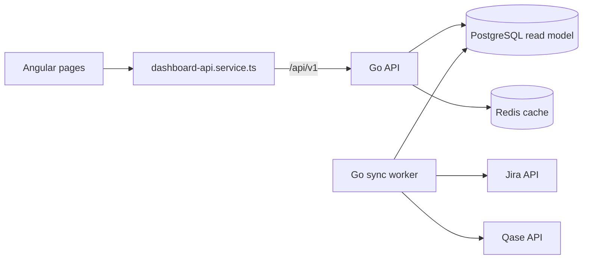

# Angular FE structure for the approved QA dashboard

**Status:** Implemented in Angular; API mode awaits configured Go services and source mappings.
**Scope:** The approved Projects, Workflow, Workload, and Bugs screens. Their appearance and demo behavior remain the visual baseline.
**Backend contract:** [Go backend MVP](./BACKEND-MVP-GO.md).

## Implemented state

The approved design is routed through `/projects`, `/workflow`, `/workload`, and `/bugs`. The root component owns the shell, shared filters, mode switch, and sync action. A shared state service holds demo-only calculations and fixtures; the typed HTTP service and live store read the Go API. API mode displays loading, empty, failure, source freshness, project detail, and durable sync-job history. The manager key is held in memory only. The dev proxy points `/api/v1` to `127.0.0.1:3002`.

## Target layout

```text
src/app/
  app.ts                         # shell: sidebar, header, router-outlet
  app.html
  app.routes.ts                   # /projects, /workflow, /workload, /bugs
  core/
    dashboard-api.service.ts     # HttpClient calls to our Go API only
    dashboard.models.ts          # API response types used by more than one page
    demo-data.ts                 # existing sample records, explicitly demo-only
  pages/
    projects/                    # list, status filters, add-project dialog
    workflow/                    # per-project execution trend
    workload/                    # allocation, capacity, run activity
    bugs/                        # defect filters and distribution
  shared/
    dashboard-dialogs/           # approved demo drill-down dialogs
    live-dashboard/              # API mode, project detail, sync history and event log
src/styles.css                   # color/spacing tokens and base styles only
```

Shared state is used where the four screens already share calculations and filters. Page-specific CSS belongs beside its page. Shared filters can live in the shell, but each page owns its own specific filters. Query parameters hold filters that users should be able to bookmark or share.

## Data flow



Angular never holds Jira or Qase credentials and never requests their APIs directly. The page receives the API's `asOf`, source freshness, and missing-data information alongside metrics. Until Go is available, the existing sample data stays behind an explicit **Demo mode** and keeps its demo label. Do not silently substitute mock data when a live request fails.

## FE/API ownership

| Screen or action | FE responsibility                                                       | Go API                                                                       |
| ---------------- | ----------------------------------------------------------------------- | ---------------------------------------------------------------------------- |
| Projects         | Filter, present, open detail, submit draft                              | `GET /api/v1/projects`, `GET /api/v1/projects/{id}`, `POST /api/v1/projects` |
| Workflow         | Choose period and display recorded trend                                | `GET /api/v1/workflow?from=&to=&projectId=`                                  |
| Workload         | Choose period/member; display hours and test activity as distinct units | `GET /api/v1/workload?from=&to=&memberId=`                                   |
| Bugs             | Search and filter defects                                               | `GET /api/v1/bugs?projectId=&severity=&status=&q=`                           |
| Sync data        | Submit once, then show progress                                         | `POST /api/v1/sync-jobs`, `GET /api/v1/sync-jobs/{id}`                       |
| Sync history     | Show prior runs, step counts, and safe error summaries                  | `GET /api/v1/sync-jobs?limit=&cursor=`                                       |

One Angular service owns the base URL, credentials, error mapping, and cancellation. A call should return a typed response rather than a page reaching into transport details. For example:

```ts
@Injectable({ providedIn: 'root' })
export class DashboardApiService {
  private readonly http = inject(HttpClient);

  getWorkload(from: string, to: string, memberId?: string) {
    const params = new HttpParams().set('from', from).set('to', to);
    return this.http.get<WorkloadResponse>('/api/v1/workload', {
      params: memberId ? params.set('memberId', memberId) : params,
    });
  }
}
```

Provide `HttpClient` once in `app.config.ts`. Keep API DTOs separate from visual labels where the shape differs. Use Angular signals/computed for local view state and derived presentation; the backend owns persisted calculations, IDs, access checks, and historical aggregates. A request has explicit loading, empty, error, and stale states. Changing a filter cancels or supersedes the older request so a slow response cannot overwrite the latest selection.

## Sync UI within the approved design

Keep **Sync data** in the header. Next to it, show the latest successful snapshot time and a small **Sync history** entry. The history can open a dialog or side panel without changing the main dashboard layout. Each row shows request time, trigger (`scheduled`/`manual`), scope, status, Jira/Qase step status, record counts, duration, and a sanitized error summary. Selecting a row shows its event timeline. A running job is polled until terminal; closing the panel does not cancel the backend job. On success, reload the current page data and its `asOf` time. On partial failure, retain the last valid metrics and display source-specific stale status.

## Migration sequence and check

1. Freeze screenshots and behavior of the four approved screens. Keep the existing demo data.
2. Extract routing and page components one screen at a time. Preserve URLs, keyboard use, dialogs, filters, and visuals.
3. Move sample data out of `App`; move shared types and calculations only where two screens actually need them.
4. Add the typed API service and explicit demo/live configuration. Wire the live calls when the Go contract is available.
5. Add sync history UI against the contract and verify queued, running, success, partial, and failure states.

Acceptance: production build succeeds; existing screen behavior and responsive layouts remain; each route opens directly; demo data is clearly labeled; a live API error never appears as a successful sync or fresh metric.
