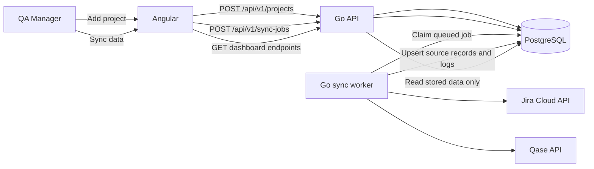

# MS Monitoring QA — Implementation Status and Plan

**Last updated:** 22 September 2026  
**Frontend:** `monitoring-qa-alfagift`  
**Backend:** `ms-monitoring-qa-be`  
**Status:** FE, Go API, worker, and PostgreSQL integration are implemented locally. Live Jira/Qase synchronization is waiting for runtime source configuration.

## 1. Product flow

Demo Mode is the approved final visual design. API Mode uses the same pages, cards, tables, filters, and charts; it only changes the data source.



The dashboard does not call Jira or Qase on page load. It reads the last stored PostgreSQL state until another sync completes.

## 2. Work completed

### Frontend

- Angular shell with sidebar, header, routing, mode switch, shared filters, sync button, and project registration.
- Routes:
  - `/projects`
  - `/workflow`
  - `/workload`
  - `/bugs`
- Demo Mode retains the approved sample dashboard.
- API Mode always renders the same approved page templates.
- Typed HTTP client for the Go API.
- Adapter from API DTOs into the existing dashboard view model.
- Explicit loading, empty, error, source freshness, and sync history states.
- Project registration form contains:
  - Jira INIT key
  - Project name
  - Qase project code
  - Qase test run number
  - QA owner
  - Staging start/end
  - Beta start/end
- Live project cards show stored passed, failed, blocked, total, run environment, platform/scope, owner, dates, and duration.
- Workflow charts use stored daily Qase results. No demo trend factors are used in API Mode.
- Workload charts use stored per-member daily execution values.
- Bugs page uses Jira issues stored by the backend.
- Values that cannot be derived from synchronized data, such as forecast ETA or velocity, display `—` instead of invented values.
- A registered project with no Qase result yet keeps the approved card layout and displays an empty chart state safely.
- Sync history shows Jira/Qase step status, counts, error codes, and job event details.

Key FE files:

| Area | File |
| --- | --- |
| Application shell | `src/app/app.ts`, `src/app/app.html` |
| Routing | `src/app/app.routes.ts` |
| API client and DTOs | `src/app/core/dashboard-api.service.ts` |
| Demo/live state adapter | `src/app/core/dashboard-state.ts` |
| Live API orchestration | `src/app/core/live-dashboard.store.ts` |
| Demo fixtures | `src/app/core/demo-data.ts` |
| Projects | `src/app/pages/projects/` |
| Workflow | `src/app/pages/workflow/` |
| Workload | `src/app/pages/workload/` |
| Bugs | `src/app/pages/bugs/` |
| Project form and sync log | `src/app/shared/live-dashboard/` |
| Shared details/dialogs | `src/app/shared/dashboard-dialogs/` |
| Local API proxy | `proxy.conf.json` → `127.0.0.1:8080` |

### Backend

- Go API uses the renamed project/module `ms-monitoring-qa-be`.
- API and worker are separate processes.
- PostgreSQL is the durable dashboard read model and job queue.
- GORM repository pattern is used for database access.
- Automatic migration covers projects, members, allocations, Jira issues, Qase cases/runs/results/membership, sync jobs, steps, events, and cursors.
- Project registration validates required fields, date ranges, INIT uniqueness, and Qase run uniqueness.
- Manager write endpoints require `X-Manager-Key` matching `MONITOR_MANAGER_API_KEY`.
- Worker claims jobs with `FOR UPDATE SKIP LOCKED`.
- Jira connector uses Jira Cloud Basic auth and approved JQL.
- Qase connector uses its API token and paginates list/result requests.
- Selected Qase run membership supplies the denominator, including `Not Run` cases.
- Latest result per case supplies passed, failed, and blocked counts.
- Source data and sync logs are upserted into PostgreSQL.
- Dashboard GET endpoints never call Jira/Qase directly.
- API responses include `asOf` and independent Jira/Qase freshness.
- Sync failures are retained as queryable job, step, and event records.

Implemented API routes:

| Method | Route | Purpose |
| --- | --- | --- |
| `GET` | `/api/v1/projects` | Stored project cards and selected Qase run summary |
| `GET` | `/api/v1/projects/{id}` | Stored project detail |
| `POST` | `/api/v1/projects` | Register INIT/Qase/date/QA mapping |
| `GET` | `/api/v1/workflow` | Stored daily project execution and pass rate |
| `GET` | `/api/v1/workload` | Stored member workload and daily execution |
| `GET` | `/api/v1/bugs` | Stored Jira defects |
| `POST` | `/api/v1/sync-jobs` | Queue Jira/Qase synchronization |
| `GET` | `/api/v1/sync-jobs` | Sync history |
| `GET` | `/api/v1/sync-jobs/{id}` | Step counts, errors, and event timeline |

Key BE files in `../ms-monitoring-qa-be`:

| Area | File |
| --- | --- |
| API entry point | `cmd/main.go` |
| Worker entry point | `cmd/worker/main.go` |
| HTTP handlers and contracts | `internal/monitoring/http.go` |
| Jira/Qase clients | `internal/monitoring/connector.go` |
| Synchronization orchestration | `internal/monitoring/worker.go` |
| Models, migrations, and queries | `internal/repository/monitoring.go` |
| Runtime configuration | `.env` plus Jira/Qase runtime environment variables |

### Database and data retained

| Data | Stored purpose |
| --- | --- |
| Project mapping | INIT, Qase scope, QA owner, Staging/Beta dates |
| Jira issues | INIT and bug records used by Projects/Bugs |
| Qase cases | Case catalogue |
| Qase runs | Run metadata, environment, platform, timestamps |
| Qase run cases | Reliable run denominator and `Not Run` calculation |
| Qase results | Historical source results and latest status calculation |
| Members/allocations | QA workload identity and planned capacity |
| Sync jobs/steps/events | Durable operational log and error detail |
| Sync cursors | Checkpoint/watermark foundation |

## 3. Current live status

Local services have been verified on:

- Angular: `http://127.0.0.1:4200`
- Go API: `http://127.0.0.1:8080`
- PostgreSQL: `localhost:5432`

The current database has no registered dashboard projects and no successful source sync. API responses therefore correctly return empty arrays and `never_synced`; API Mode shows zero/empty states inside the approved design.

The existing failed log records:

- `JIRA_CONFIG_MISSING`
- `QASE_CONFIG_MISSING`

These are runtime configuration failures, not FE–BE connection failures. The browser is already reaching the Go API and reading PostgreSQL-backed responses.

## 4. Runtime configuration still required

Provide these through runtime secrets/environment, not Angular or Git:

| Variable | Status/purpose |
| --- | --- |
| `JIRA_BASE_URL` | **Still required**, e.g. tenant origin `https://company.atlassian.net` |
| `JIRA_EMAIL` | Provided Jira account email |
| `JIRA_API_TOKEN` | Provided Jira API token |
| `JIRA_ACTIVE_JQL` | Load the supplied JQL file temporarily |
| `JIRA_BUG_JQL` | Still requires the approved bug-to-INIT rule/JQL |
| `QASE_API_TOKEN` | Provided token; load as a runtime secret |
| `QASE_BASE_URL` | Optional; defaults to `https://api.qase.io` |
| `MONITOR_MANAGER_API_KEY` | Required for Add Project and Sync data writes |

The supplied JQL file can be loaded at runtime:

```bash
export JIRA_ACTIVE_JQL="$(cat '/Users/admin/Downloads/project = INIT AND status not in (C.txt')"
```

Do not commit the supplied Jira or Qase tokens.

## 5. How the charts become populated

1. Open API Mode.
2. Enter the manager key.
3. Select **Add project**.
4. Save the INIT key, Qase project/run, QA owner, and Staging/Beta dates.
5. The Go API stores the project immediately as `pending_validation`.
6. Select **Sync data**.
7. The worker validates Jira/Qase, imports data page by page, and stores it in PostgreSQL.
8. FE refreshes the API snapshot:
   - Projects cards use stored run totals and results.
   - Workflow graphs use daily cumulative Qase results.
   - Workload graphs use daily results grouped by Qase member.
   - Bugs uses stored Jira issue records.
   - Sync history shows the job and source step details.
9. Subsequent page loads read PostgreSQL and do not hit Jira/Qase again until another sync job runs.

## 6. Verification completed

| Check | Result |
| --- | --- |
| Angular unit/component tests | `8/8` passed |
| Angular production build | Passed |
| Go tests | `go test ./...` passed |
| Whitespace/error check | `git diff --check` passed in both repositories |
| Browser verification | Projects, Workflow, Workload, Bugs, mode switching, source status, and sync log verified |
| API verification | Projects, Workflow, Workload, and Bugs return PostgreSQL-backed empty state successfully |

## 7. Plan

### Phase 1 — Activate one real project

1. Obtain `JIRA_BASE_URL`.
2. Configure all runtime secrets and a manager key.
3. Confirm the supplied JQL can read the intended INIT issues.
4. Confirm the Qase project code and selected test run.
5. Register one pilot INIT through the FE.
6. Run sync and compare PostgreSQL/API totals against Jira and Qase UI.
7. Verify graphs, platform labels such as AOS/iOS/BO, owners, dates, and `Not Run` denominator.

### Phase 2 — Complete production mapping

1. Approve the Jira bug-to-INIT relation and `JIRA_BUG_JQL`.
2. Confirm whether one INIT tracks one selected Qase run or several platform/environment run IDs.
3. If several run IDs belong to one INIT, add a project-to-runs mapping table and change the registration form to accept multiple runs.
4. Confirm Jira account ID ↔ Qase member ID ↔ internal QA identity mapping.
5. Confirm the required history window and expected project volume.

### Phase 3 — Harden synchronization

1. Validate Qase timestamp semantics against the real tenant.
2. Add safe incremental cursors with overlap after the full import is verified.
3. Reconcile active runs and project scope on the scheduled sync.
4. Add bounded retry/backoff for `429` and transient `5xx` responses.
5. Add metrics and alerts for stale sources, failed jobs, duration, and record-count drift.

### Phase 4 — Production readiness

1. Replace the temporary manager key with organization authentication and roles.
2. Add project-level authorization to dashboard reads.
3. Move credentials to the deployment secret manager.
4. Package API and worker for the deployment environment.
5. Configure the agreed 08:00 and 17:00 Asia/Jakarta schedule.
6. Run acceptance checks with QA using one real project before enabling the full portfolio.

## 8. Current scope boundary

The current implementation maps one registered INIT to one selected Qase run. It can render that run's real environment/platform and results. If AOS, iOS, BO, DB, and API are separate Qase run IDs that must appear together in one project card, Phase 2 item 3 is required before calling the multi-platform view complete.

